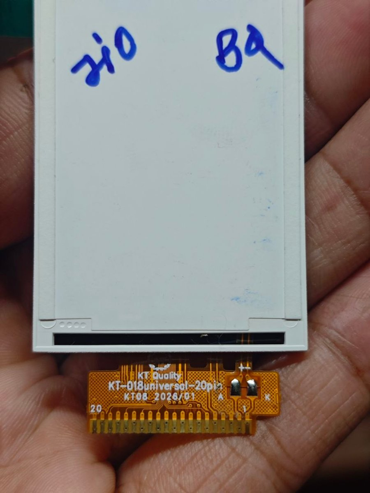
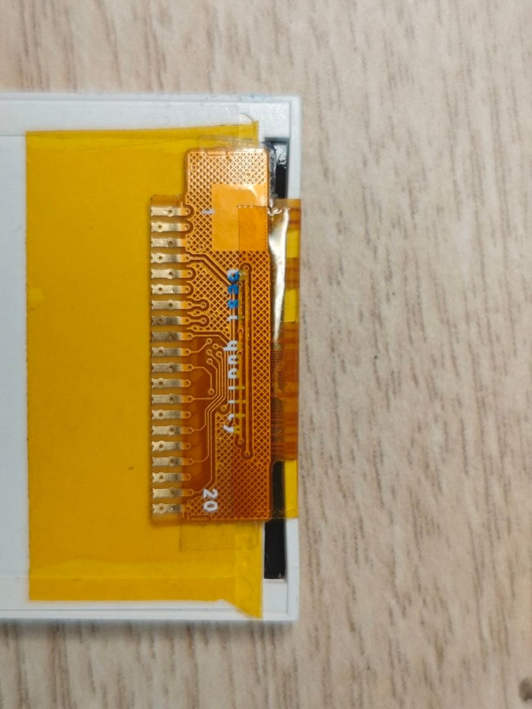
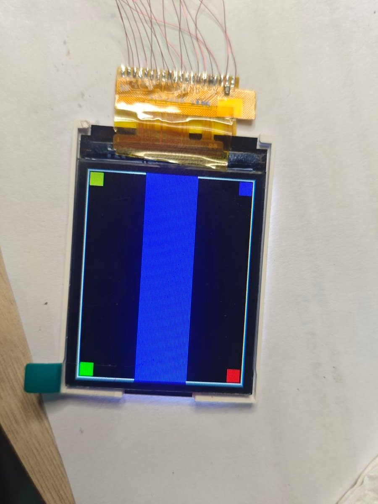
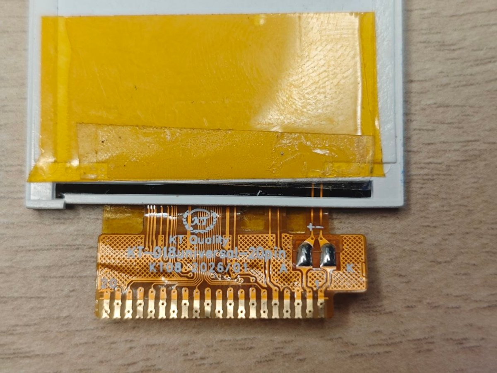
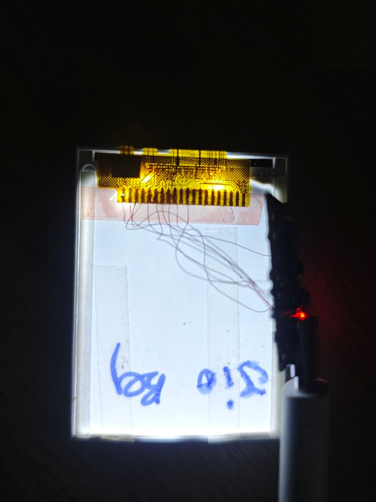
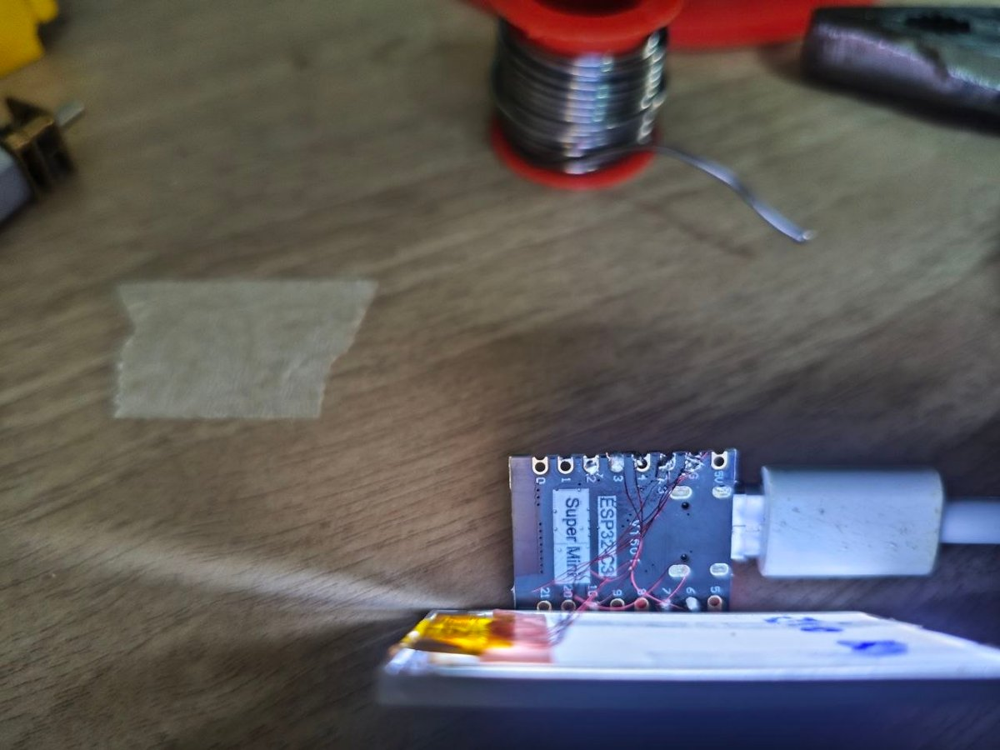

# KT-018 universal 20-pin: 1.8" 128×160, 8-bit parallel

| | |
|---|---|
| **Flex marking** | `KT Quality · KT-018universal-20pin · KT08 2026/01` |
| **Interface** | 8-bit 8080 parallel (CS, RS, WR, RD, RESET, D0–D7) |
| **Command set** | MIPI DCS, ST7735-style (controller ID cannot be read) |
| **Status** | ✅ **Verified on an ESP32 (NodeMCU-32S)**: correct colours, full-screen border, correct corner orientation |

<p>
  
  
  
</p>
<p>
  
  
  
</p>

*Top row, left to right:* flex label, flex pads, and the working alignment screen.
*Bottom row, left to right:* pin-1 marking, backlight test (before the interface was known), and the first wiring attempt on an ESP32-C3.

> **Warning:** this is **not an SPI panel**. A widely shared "KT-018 SPI" pinout (pin 6 = DC, 8 = SCL, 9 = SDA) is wrong for this flex. Wiring it as SPI gives a blank screen.

## Specifications

| Item | Value |
|---|---|
| Resolution | 128 × 160. Any window larger than this is **rejected**, so don't use 132 × 162. |
| Pixel format | RGB565, 2 bytes per pixel, high byte first (`COLMOD = 0x05`) |
| Inversion | Off (`INVOFF 0x20`) |
| Orientation | `MADCTL = 0xC0` gives an upright image with the flex at the top. Use `0x00` for the flex at the bottom. |
| Data bus | **Reversed along the flex**: pin 12 = D7 … pin 19 = D0 |
| Read-back | None. Reads return `00`, so treat the panel as write-only. |
| Supply | 3.3 V on pins 4 and 5 |
| Backlight | LEDs in parallel. 3.3 V through 22–33 Ω. |

## Pinout

Pin 1 is the **right-hand** pad, next to the printed "1" / "K".

| Pin | Signal | Direction | ESP32 (NodeMCU-32S) |
|:-:|---|---|:-:|
| 1 | LEDK (backlight −) | power | GND |
| 2 | LEDA (backlight +) | power | 3.3 V through 22–33 Ω |
| 3 | GND | power | GND |
| 4 | VCC | power | 3.3 V |
| 5 | VCC | power | 3.3 V |
| 6 | TE (frame sync) | panel → MCU | GPIO 34 (optional) |
| 7 | CS | MCU → panel | GPIO 15 |
| 8 | RESET | MCU → panel | GPIO 4 |
| 9 | RS (D/C) | MCU → panel | GPIO 2 |
| 10 | WR | MCU → panel | GPIO 18 |
| 11 | RD | MCU → panel | GPIO 23 (or 3.3 V) |
| 12 | **D7** | MCU → panel | GPIO 12 |
| 13 | D6 | MCU → panel | GPIO 13 |
| 14 | D5 | MCU → panel | GPIO 26 |
| 15 | D4 | MCU → panel | GPIO 19 |
| 16 | D3 | MCU → panel | GPIO 17 |
| 17 | D2 | MCU → panel | GPIO 16 |
| 18 | D1 | MCU → panel | GPIO 27 |
| 19 | **D0** | MCU → panel | GPIO 14 |
| 20 | GND | power | GND |

**Multimeter signature** (diode mode, red probe on pin 3):

| Pins | Reading |
|---|---|
| 4 | 0.52 V |
| 5 | 0.47 V |
| 6–11 | 0.93–0.96 V |
| 12–19 | 0.92 V, all identical (this is the data bus) |
| 3, 20 | beep (GND) |

### Other microcontrollers

At least 12 output pins are needed: D0–D7, RS and WR, with CS tied to GND and RESET to 3.3 V. The tied-off variant hasn't been tested on this panel. Use 3.3 V logic only; a 5 V board needs level shifters (74LVC245 / 74HC4050).

| Board | D0–D7 | RS | WR | CS | RESET |
|---|---|---|---|---|---|
| Raspberry Pi Pico | GP0–GP7 (pin 19 → GP0 … pin 12 → GP7) | GP8 | GP9 | GP10 | GP11 |
| STM32F103 | PA0–PA7 (pin 19 → PA0 … pin 12 → PA7) | PB0 | PB1 | PB10 | PB11 |

These maps are suggestions only, not tested.

## Initialisation (verified)

```
RESET low 20 ms → high, wait 150 ms
0x01 SWRESET              wait 150 ms
0x11 SLPOUT               wait 150 ms
0x3A COLMOD   0x05
0x36 MADCTL   0xC0
0x20 INVOFF
0x13 NORON
0x29 DISPON
```

To draw, send `0x2A CASET` (x ≤ 127), `0x2B RASET` (y ≤ 159), then `0x2C RAMWR` followed by 2 bytes per pixel.

## Firmware

[`firmware/esp32-parallel-test`](firmware/esp32-parallel-test) (PlatformIO, NodeMCU-32S) contains:

- **A bit-banged 8080 driver**, with the verified pinout built in. On boot it cycles red, green, blue, white and black, then shows an alignment screen (white border, R/G/B/Y corners and a big "8").
- **The pin scanner used to find the pinout.** Set `RUN_SCANNER = true` to run it again on an unknown panel.

```bash
cd firmware/esp32-parallel-test
pio run -t upload --upload-port COMx
```

## Issues and how they were solved

| # | Issue | Cause | Solution |
|:-:|---|---|---|
| 1 | Blank screen with the "standard" SPI wiring | The panel is not SPI | Identified the interface by measurement (next row). |
| 2 | Unknown pinout | No usable datasheet | **Diode-mode survey**: about 0.5 V marks a power pin, about 0.9 V a signal pin. 8 adjacent identical readings revealed the data bus. 14 signal pins means 8-bit parallel. |
| 3 | Pin 6 measured as ground | **Solder bridge** across pads 6–9 after reworking pin 7 | Cleaned the pads, then beep-tested every pair of neighbouring pads. |
| 4 | ESP32-C3 GPIO 2 stuck at 3.3 V even with nothing connected | Fault on that particular C3 board | Stopped using GPIO 2, and moved the project to an ESP32 with more pins. |
| 5 | Control pin order unknown | Panel never returns data | **Bus-drive test**: the panel only drove the data bus when pins 7 and 11 were both low, so those are CS and RD. Then a **visual test**: each of the 12 remaining orders drew its own number on a red screen, and only "11" rendered. |
| 6 | Nothing displayed in either "normal" order | The data bus is **wired backwards** (pin 12 = D7) | Repeated the visual test with the bus reversed, which succeeded. |
| 7 | GPIO 34/35/39 didn't work for WR or a data line | These ESP32 pins are **input-only** | Moved to GPIO 18 and 19. Only TE (an output from the panel) uses GPIO 34. |
| 8 | Upload failed: "No serial data received" | The panel holds ESP32 strapping pins (GPIO 2 / 12) at reset | Manual download mode (hold BOOT, tap EN, release BOOT), then `esptool --before no_reset`. |
| 9 | First screen fine, then vertical stripes | A **132×162** window was rejected, so later fills piled into the last small window | Always use exactly 0..127 × 0..159. |
| 10 | Picture upside-down (corner colours diagonally swapped) | Panel mounting | `MADCTL = 0xC0`. |
| 11 | ESP32 dropped off USB while flashing | Backlight load on the 3.3 V regulator | Use a backlight resistor, or feed LEDA from 5 V through about 68 Ω. |

## Troubleshooting

| Symptom | Check |
|---|---|
| White screen, backlight on | 3.3 V on pins 4 and 5, and CS / RS / WR wiring |
| Black screen that never changes | The data bus order (pin 19 must be D0), and the RS / WR swap |
| Negative colours | Send `INVOFF (0x20)`, not `INVON` |
| Stripes after the first frame | Window larger than 128 × 160 |
