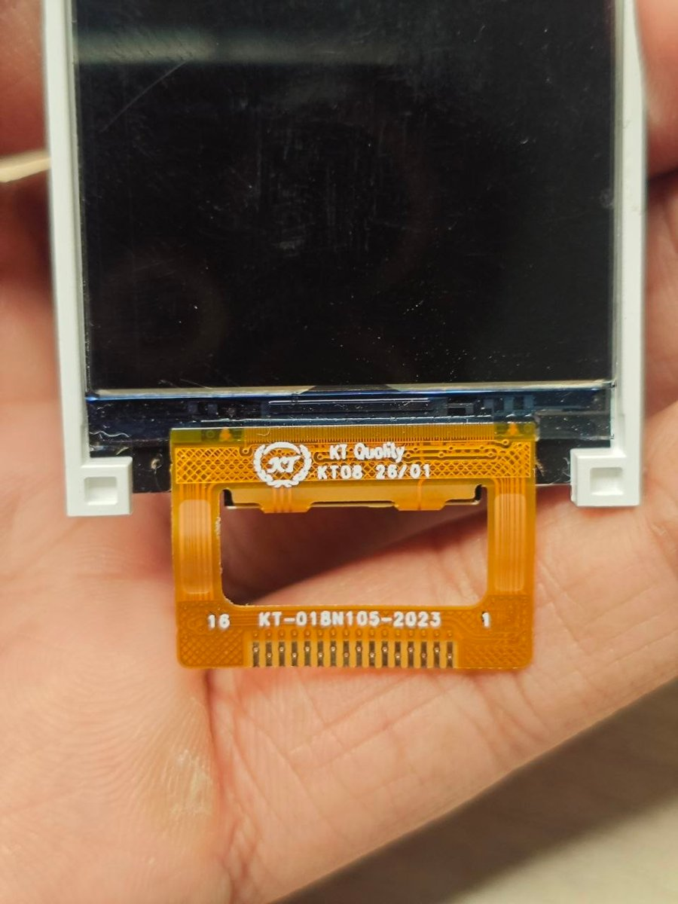

# KT-018N105-2023 16-pin (Nokia 105 2023 replacement): 1.8" 128×160, 4-wire SPI

| | |
|---|---|
| **Flex marking** | `KT Quality · KT08 26/01 · KT-018N105-2023` |
| **Interface** | **4-wire SPI**: SCK, SDA, CS, DC, RESET |
| **Command set** | ST7735-compatible. The controller ID **cannot be read**: the panel is write-only. |
| **Status** | ✅ **Verified on an ESP32-C3 SuperMini**: correct colours, alignment corners in the right places, number upright |



> **Note:** this panel needs **pin 12 powered**, the **full ST7735 initialisation**, and **`MADCTL = 0xC0`**. Without these it stays blank, flashes briefly, or shows images upside-down.

## Specifications

| Item | Value |
|---|---|
| Resolution | 128 × 160 |
| Pixel format | RGB565, `COLMOD = 0x05` |
| Colour order | RGB (normal) |
| Orientation | `MADCTL = 0xC0` gives an upright image with the flex at the bottom. With `0x00` the image is rotated 180°. |
| Inversion | Off |
| Read-back | None (no reply on SDA or on pin 2) |
| Supply | 3.3 V on pins 3, 5 **and 12** |
| Backlight | LED+ pin 13; LED− pins 14 and 15 |

## Pinout

Pin 1 is the **right-hand** pad, next to the printed "1"; pin 16 is on the left.

| Pin | Signal | ESP32-C3 SuperMini (as tested) |
|:-:|---|:-:|
| 1 | GND | G |
| 2 | Output from the panel (held low; probably TE) | — (optional input) |
| 3 | Power | 3.3 |
| 4 | GND | G |
| 5 | Power | 3.3 |
| 6 | **RESET** | GPIO 5 |
| 7 | **DC** | GPIO 6 |
| 8 | **SCK** | GPIO 7 |
| 9 | **SDA** | GPIO 10 |
| 10 | **CS** | GPIO 3 |
| 11 | GND | G |
| 12 | Power (reads 0 V until it is supplied) | **3.3** (required) |
| 13 | LED+ | 3.3 through 22–33 Ω |
| 14, 15 | LED− | G |
| 16 | GND | G |

**Multimeter signature** (diode mode, red probe on pin 1):

| Pins | Reading |
|---|---|
| 3, 5 | 0.48 V |
| 12 | 0.52 V |
| 2, 6–10 | 0.92–0.95 V |
| 1, 4, 11, 16 | beep (GND) |

### Other microcontrollers (suggested, not tested)

| Board | SCK | SDA (MOSI) | CS | DC | RESET |
|---|---|---|---|---|---|
| ESP32 DevKit | 18 | 23 | 5 | 2 | 4 |
| Raspberry Pi Pico | GP18 | GP19 | GP17 | GP20 | GP21 |
| STM32F103 | PA5 | PA7 | PA4 | PB0 | PB1 |
| Arduino Uno (5 V, **needs level shifting**) | 13 | 11 | 10 | 9 | 8 |

A standard ST7735 SPI driver, such as TFT_eSPI with `ST7735_DRIVER` or Adafruit_ST7735, should work with this pinout if it uses the full "red tab" init and a 180° rotation. **Not tested.**

## Initialisation (verified)

This is the standard ST7735R ("red tab") sequence plus `MADCTL 0xC0`:

```
RESET high 5 ms → low 20 ms → high, wait 150 ms
0x01 SWRESET                                   wait 150 ms
0x11 SLPOUT                                    wait 500 ms
0xB1 FRMCTR1  01 2C 2D
0xB2 FRMCTR2  01 2C 2D
0xB3 FRMCTR3  01 2C 2D 01 2C 2D
0xB4 INVCTR   07
0xC0 PWCTR1   A2 02 84
0xC1 PWCTR2   C5
0xC2 PWCTR3   0A 00
0xC3 PWCTR4   8A 2A
0xC4 PWCTR5   8A EE
0xC5 VMCTR1   0E
0x20 INVOFF
0x3A COLMOD   05
0xE0 GMCTRP1  02 1C 07 12 37 32 29 2D 29 25 2B 39 00 01 03 10
0xE1 GMCTRN1  03 1D 07 06 2E 2C 29 2D 2E 2E 37 3F 00 00 02 10
0x13 NORON                                     wait 10 ms
0x29 DISPON                                    wait 100 ms
0x36 MADCTL   C0
```

## Firmware

| Folder | What it does | Hardware status |
|---|---|---|
| [`firmware/esp32c3-gif-player`](firmware/esp32c3-gif-player) | Wi-Fi GIF / image player. The driver, [`src/lcd4.cpp`](firmware/esp32c3-gif-player/src/lcd4.cpp), is 4-wire hardware SPI with DMA and the init above. The browser converts files to 128 × 160 RGB565, and the C3 stores about 33 frames. | ✅ verified: GIF playback shown in the [demo video](../../media/demo.mp4) |

To use the GIF player:
1. Join Wi-Fi `N105-2023-Display`, password `n105display`.
2. Open `http://192.168.4.1` and upload a file.

The pinout was found and verified with [`../../tools/spi-pin-scanner`](../../tools/spi-pin-scanner). Its `FC0` command runs the verified test: a colour cycle, then the alignment screen.

## Issues and how they were solved

| # | Issue | Cause | Solution |
|:-:|---|---|---|
| 1 | No published pinout | Replacement part | Multimeter survey: GND, three power pins, backlight, and 6 signal pins (2, 6–10). |
| 2 | Pin 2 always low | It is an **output** from the panel (probably TE) | A pull-up / pull-down test showed the panel drives it, so it is excluded from all roles. |
| 3 | Panel never answered any ID read | **Pin 12 unpowered**, and the panel is **write-only** | Measured pin 12 at 0 V while pins 3 and 5 were powered, so it is a separate supply input. Connected it to 3.3 V (checked through 100 Ω first). The panel still never answers reads, so it is write-only. |
| 4 | Read-based scans useless | Write-only panel | **Visual scan**: every pin order (120 for 4-wire, 120 for 3-wire) draws its own 3-digit number on a red screen. |
| 5 | The scan reported "**160**", but 160 never worked alone | **The panel shows images rotated 180°.** Upside-down, 7-segment "**091**" reads as "160" (the 9 becomes a 6) | A test that drew "002" was seen as "200", which exposed the rotation. Candidate 091 (RESET 6, DC 7, SCK 8, SDA 9, CS 10) was the correct pinout all along. |
| 6 | The image appeared, then **faded or went black** | The minimal init (SWRESET, SLPOUT, COLMOD, DISPON) doesn't set power, VCOM and gamma | Use the full ST7735R init. |
| 7 | Bisecting the scan gave confusing results | The old image stayed in display memory, and **other** candidates briefly switched the display on and showed it | Treated a "flash" as a display-on event, not a new drawing. Flash-only candidates (085 and 091) pointed to SCK 8 and SDA 9. |
| 8 | Image upside-down | Panel mounting | `MADCTL = 0xC0`. |

**Lesson for other panels:** when identifying candidates by drawing numbers, use digits or corner markers that read differently when rotated. Otherwise a 180°-mounted panel sends you after the wrong candidate.

## Troubleshooting

| Symptom | Check |
|---|---|
| Image flashes, then goes black | Full init; pin 12 at 3.3 V |
| Nothing at all, backlight on | Pins 3, 5 and 12 at 3.3 V, then RESET (pin 6) and CS (pin 10) |
| Upside-down | `MADCTL 0xC0` (or `0x00` if the flex points up) |
| ID reads return nothing | Expected: the panel is write-only |
| Garbled picture with hardware SPI | Lower `SPI_HZ` in `src/main.cpp` to 8–10 MHz |
