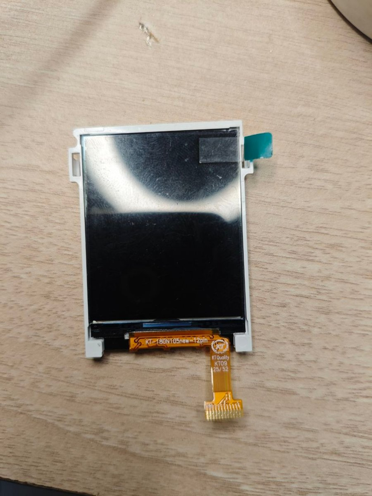

# KT-180N105new 12-pin (Nokia 105 replacement): 1.8" 128×160 ST7735S, 3-wire 9-bit SPI

| | |
|---|---|
| **Flex marking** | `KT-180N105new-12pin · KT Quality · KT09 25/52` |
| **Interface** | **3-wire serial, 9-bit words.** There is **no DC pin**: the D/C flag is sent as the first bit of every word. |
| **Controller** | Sitronix **ST7735S**. RDDID reads `7C 89 F0`. |
| **Status** | ✅ **Verified on an ESP32-C3 SuperMini**: ID read, `RDDPM = 9C` after init, settings read back correctly, full-screen fill in the correct colour |



## Specifications

| Item | Value |
|---|---|
| Resolution | 128 × 160 (window `0..127 × 0..159`) |
| Pixel format | RGB565, `COLMOD = 0x05` |
| Colour order | **BGR**: `MADCTL = 0x08`. Without it, red and blue are swapped. |
| Inversion | Off |
| Read-back | Works over the bidirectional SDA line |
| Supply | 3.3 V (VDDI and VDD) |
| Backlight | LED+ / LED−. 3.3 V through 22–33 Ω. |

## Pinout

| Pin | Signal | ESP32-C3 SuperMini |
|:-:|---|:-:|
| 1 | NC | — |
| 2 | RESET | GPIO 4 |
| 3 | CS | GPIO 10 |
| 4 | GND | G |
| 5 | SDA (9-bit data, bidirectional) | GPIO 7 |
| 6 | SCK | GPIO 6 |
| 7 | VDDI (I/O supply) | 3.3 |
| 8 | VDD (core supply) | 3.3 |
| 9 | GND | G |
| 10 | LED− | G |
| 11 | LED+ | 3.3 through 22–33 Ω |
| 12 | NC | — |

GPIO 6 and 7 are the C3's FSPI IO_MUX pads, used here for hardware SPI.

## The 9-bit protocol

```
CS  ‾‾\________________________________________/‾‾
SCK ____/‾\_/‾\_/‾\_/‾\_/‾\_/‾\_/‾\_/‾\_/‾\________   data sampled on the rising edge
SDA     D/C  b7  b6  b5  b4  b3  b2  b1  b0           D/C: 0 = command, 1 = data
```

- `DISPON (0x29)` is sent as `0 0010 1001`.
- A pixel is 2 data words, 18 clocks in total.

Standard ST7735 libraries (TFT_eSPI, Adafruit) expect a DC pin and 8-bit transfers, so they **don't work unmodified**.

## Initialisation (verified)

```
RESET low 20 ms → high, wait 150 ms
0x01 SWRESET            wait 150 ms
0x11 SLPOUT             wait 255 ms
0x3A COLMOD   0x05
0x36 MADCTL   0x08      BGR
0x20 INVOFF
0x13 NORON
0x29 DISPON
```

## Driver: hardware 9-bit SPI on the ESP32-C3

[`firmware/esp32c3-gif-player/src/lcd9.cpp`](firmware/esp32c3-gif-player/src/lcd9.cpp) drives the panel through the C3's SPI2 peripheral with DMA:

- **Packing:** the 9-bit words are packed MSB-first into a byte stream and sent as bit-length transactions.
- **Chip select:** CS is driven by hand and held low for a whole frame.
- **Padding:** the last byte is padded with zeros, which form an incomplete word that the panel discards when CS rises.

## Firmware

| Folder | What it does | Hardware status |
|---|---|---|
| [`firmware/esp32c3-gif-player`](firmware/esp32c3-gif-player) | Wi-Fi GIF / image player. The browser crops or fits the image to 128 × 160 (with optional rotation and dithering) and converts it to RGB565. The C3 stores up to about 33 frames in LittleFS and plays them through the 9-bit SPI driver. | ⚠ builds and boots; playback through the hardware-SPI driver not yet confirmed on screen |

To use the GIF player:
1. Join Wi-Fi `KT105-Display`, password `kt105disp`.
2. Open `http://192.168.4.1` and upload a file.

The pinout and init were verified with a bit-banged 3-wire test (the same pins and commands). The ID, status and colours were all confirmed.

## Issues and how they were solved

| # | Issue | Cause | Solution |
|:-:|---|---|---|
| 1 | No DC pin on the flex | The panel uses **3-wire 9-bit SPI** | Sent the D/C flag as an extra first bit. Bit-banged for testing, and packed 9-bit words over hardware SPI in the player. |
| 2 | ST7735 libraries couldn't drive it | They need a DC pin and 8-bit transfers | Wrote a dedicated driver (`lcd9.cpp`). |
| 3 | Red shown as blue, and blue as red | The panel's colour order is BGR | `MADCTL = 0x08`. |
| 4 | Is CS needed, or can it be tied to GND? | 9-bit framing is realigned on the falling edge of CS | Kept CS on a GPIO. With CS tied low, one stray clock would misalign every later word until a power cycle. |
| 5 | Confirming the controller | Replacement panels don't always use the same chip as the original | Read RDDID over SDA: `7C 89 F0` (ST7735S). |

## Troubleshooting

| Symptom | Check |
|---|---|
| Red / blue swapped | `MADCTL 0x08` |
| Works, then garbage until power-cycle | 9-bit framing lost. Drive CS from a GPIO. |
| Garbled picture with the hardware-SPI driver | Lower `SPI_HZ` in `src/main.cpp` (e.g. to 10 MHz) |
