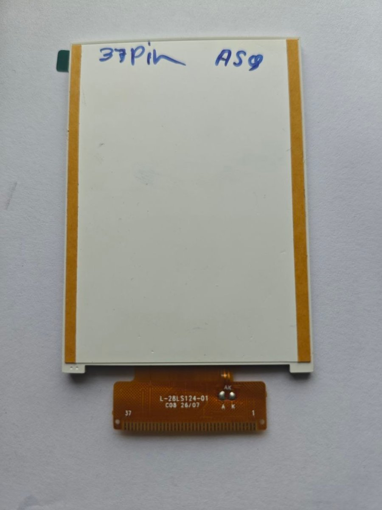

# L-28LS124-01 (F0-28LS124-01) 37-pin: 2.8" 240×320 ST7789V, 8-bit parallel

| | |
|---|---|
| **Flex marking** | `L-28LS124-01 · C08 26/07` |
| **Interface** | 8-bit 8080 parallel (CS, RS, WR, RD, RESET, DB8–DB15) |
| **Controller** | Sitronix **ST7789V**. RDDID reads `85 85 52`. |
| **Status** | ✅ **Verified on an ESP32 (NodeMCU-32S)**: ID read, display memory write/read-back, correct colours. About 43 full-screen fills per second. |



## Specifications

| Item | Value |
|---|---|
| Resolution | 240 × 320 |
| Pixel format | RGB565, 2 bytes per pixel, high byte first |
| Inversion | **Off** (`INVOFF 0x20`). With INVON the picture is a negative. |
| Read-back | Works. ID and status registers read correctly. GRAM reads back as 18-bit, 3 bytes per pixel. |
| Supply | 3.3 V on pins 2 and 3 (not joined to each other on the flex) |
| Backlight | LEDs in parallel (LEDK pins 31–34 are joined). 3.3 V through 5–10 Ω. |

## Pinout

Pin 1 is the **right-hand** pad, next to the printed "1"; pin 37 is on the left.

| Pin | Signal | ESP32 (NodeMCU-32S) |
|:-:|---|:-:|
| 1 | GND | GND |
| 2 | VCC | 3.3 V |
| 3 | IOVCC | 3.3 V |
| 4 | CS | GPIO 33 |
| 5 | RS (D/C) | GPIO 15 |
| 6 | WR | GPIO 4 |
| 7 | RD | GPIO 2 |
| 8 | RESET | GPIO 32 |
| 9–12 | Unknown inputs (probably interface-mode straps) | Leave unconnected (verified working floating) |
| 13–16 | GND (joined on the flex) | optional |
| 17 | DB8 = D0 | GPIO 12 |
| 18 | DB9 = D1 | GPIO 13 |
| 19 | DB10 = D2 | GPIO 26 |
| 20 | DB11 = D3 | GPIO 25 |
| 21 | DB12 = D4 | GPIO 17 |
| 22 | DB13 = D5 | GPIO 16 |
| 23 | DB14 = D6 | GPIO 27 |
| 24 | DB15 = D7 | GPIO 14 |
| 25 | GND | optional |
| 26 | TE (frame-sync output from the panel) | Leave unconnected, or any input pin |
| 27–29 | NC | — |
| 30 | LEDA (backlight +) | 3.3 V through 5–10 Ω |
| 31–34 | LEDK (backlight −) | GND |
| 35, 36 | GND | GND |
| 37 | NC | — |

**Multimeter signature** (diode mode, red probe on pin 1):

| Pins | Reading |
|---|---|
| 2, 3 | 0.49 V |
| 4–12 | 0.89–0.92 V |
| 17–24 | 0.88–0.89 V |
| 26 | 0.90 V |
| 1, 13–16, 25, 35, 36 | beep (GND) |

### Other microcontrollers (suggested, not tested)

| Board | D0–D7 | RS | WR | CS | RESET | RD |
|---|---|---|---|---|---|---|
| Raspberry Pi Pico | GP0–GP7 (pin 17 → GP0) | GP8 | GP9 | GP10 | GP11 | GP12 |
| STM32F103 / F4 | PA0–PA7 (pin 17 → PA0) | PB0 | PB1 | PB10 | PB11 | PB12 |

Use 3.3 V logic. A 5 V board (Arduino Mega) needs 74LVC245 level shifters.

## TFT_eSPI configuration (verified)

```ini
-D USER_SETUP_LOADED=1
-D ST7789_DRIVER=1
-D TFT_WIDTH=240
-D TFT_HEIGHT=320
-D TFT_PARALLEL_8_BIT=1
-D TFT_CS=33
-D TFT_DC=15
-D TFT_WR=4
-D TFT_RD=2
-D TFT_RST=32
-D TFT_D0=12
-D TFT_D1=13
-D TFT_D2=26
-D TFT_D3=25
-D TFT_D4=17
-D TFT_D5=16
-D TFT_D6=27
-D TFT_D7=14
-D TFT_INVERSION_OFF=1   ; required: the library's ST7789 init always sends INVON
```

## Firmware

| Folder | What it does | Hardware status |
|---|---|---|
| [`firmware/esp32-st7789-test`](firmware/esp32-st7789-test) | Display test. Reads the controller ID and searches strap levels for pins 9–12. Cycles colours, colour bars, an alignment grid, text and a speed test. Serial commands (`n`, `p`, `i`, `r`, `d`, `m`, `o`, `s`) control it. | ✅ verified |
| [`firmware/esp32-gif-player`](firmware/esp32-gif-player) | Wi-Fi GIF / image player. The browser resizes the file to 240 × 320 and converts it to RGB565; the ESP32 stores it in a 2.4 MB LittleFS and streams frames to the panel in 16-row strips. About 15 frames fit. | ⚠ builds and boots; Wi-Fi upload not yet confirmed on hardware |

To use the GIF player:
1. Join Wi-Fi `KT28-Display`, password `kt28display`.
2. Open `http://192.168.4.1` and upload a file.

```bash
cd firmware/esp32-gif-player
pio run -t upload --upload-port COMx
```

## Issues and how they were solved

| # | Issue | Cause | Solution |
|:-:|---|---|---|
| 1 | Seller pinout didn't match the panel | The "F0-" datasheet differs from this **"L-" flex**: it lists pin 9 as GND and 10–16 / 25 as NC | Full multimeter survey. Pins 9–12 turned out to be signals, and 13–16 and 25 are GND. |
| 2 | Five unidentified signal pins (9–12, 26) | Probably interface-mode straps and TE | Classified each with ESP32 pull-up / pull-down tests: 26 is driven by the panel (TE), and 9–12 are inputs. The panel works with 9–12 floating. |
| 3 | **White screen** even though the ID read was correct | The panel needs inversion **off**, and TFT_eSPI's ST7789 init always sends INVON | A GRAM write/read-back test proved the memory was correct, and a display on/off test proved the glass worked. Fixed with `-D TFT_INVERSION_OFF=1`. (`TFT_INVERSION_ON` changes nothing, because INVON is already sent.) |
| 4 | `readPixel()` returned wrong values (`0x2400` for every colour) | GRAM read-back is 18-bit (3 bytes per pixel) | Read the raw `RAMRD` bytes instead. Drawing is unaffected. |
| 5 | ESP32 dropped off USB during flashing | Backlight current sagging the 3.3 V rail | Fit a series resistor, or power LEDA from 5 V through about 33 Ω. |
| 6 | A 150 KB frame won't fit in RAM (no PSRAM) | Free heap is smaller than one frame | The GIF player streams each frame from flash in 7.5 KB strips. |

## Troubleshooting

| Symptom | Check |
|---|---|
| White screen, but the ID reads `85 85 52` | Inversion: use `TFT_INVERSION_OFF` |
| Red and blue swapped | MADCTL BGR bit, or `TFT_RGB_ORDER` |
| ID reads `00 00 00` / `FF FF FF` | RD / RS / CS wiring, and solder bridges on the data pads |
